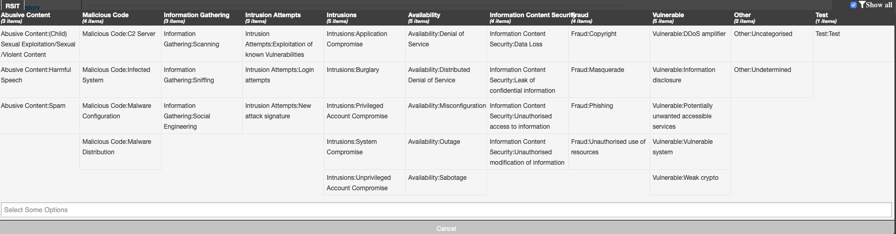
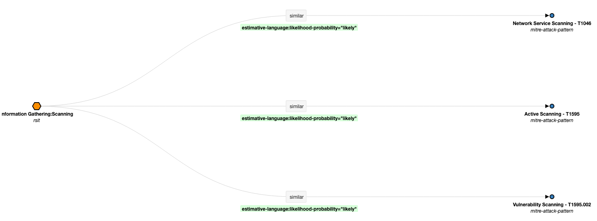
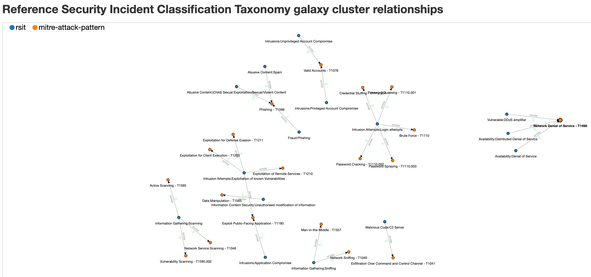

# RSIT and ATT&CK

Create a relation between the classifications in [RSIT](https://github.com/enisaeu/Reference-Security-Incident-Taxonomy-Task-Force) and [ATT&CK](https://attack.mitre.org).

The primary use will be in MISP via a [Galaxy/Cluster](https://www.misp-project.org/galaxy.html). Galaxies allow to add complex -often for human consumption- context to threat data. Typically used galaxies are the [ATT&CK techniques](https://github.com/MISP/misp-galaxy/blob/main/clusters/mitre-attack-pattern.json), [ATT&CK software](https://github.com/MISP/misp-galaxy/blob/main/clusters/mitre-malware.json) or [ATT&CK adversary groups](https://github.com/MISP/misp-galaxy/blob/main/clusters/mitre-intrusion-set.json).

The relation between RSIT and ATT&CK is based on the **machinev1** file from the working copy. This file is what's used as the [MISP taxonomy](https://github.com/MISP/misp-taxonomies/tree/main/rsit). Note that in the MISP taxonomy the file is called **machinetag.json**.

# Usage

## RSIT MISP Taxonomy

The RSIT MISP taxonomy now contains an extra field **attck**. The field is not used by MISP taxonomy processing but only used to generate the human readable table and the relationship to the ATT&CK techniques. Note that you can use this modified taxonomy file (machinetag.json) -with the extra field- in your MISP environment, it will just ignore the new field.

## Format

The value supports a **list** of one or more ATT&CK techniques.

For example
```
"attck": [ 
    { "dest-uuid": "d74c4a7e-ffbf-432f-9365-7ebf1f787cab", "MITRE": "T1498 -  Network Denial of Service", "timestamp": 20200128 }
]
```

## Fields

The necessary fields are

- **dest-uuid**: The link to the ATT&CK technique. This UUID field can be found in the [MISP ATT&CK technique](https://github.com/MISP/misp-galaxy/blob/main/clusters/mitre-attack-pattern.json).
- **MITRE**: A text field which is used to create the web link in the human readable table. Format is 'Technique - Description'
- **timestamp**: (optional) The timestamp when the link to the ATT&CK technique was added. Format is YYYYMMDD


# Workflow

```
+---------------+   +---------+   +----------------------+   +-------------------------+   +-------------+
| machinev1     |   |Add attck|   | Human readable table |   |Galaxy / Cluster         |   | Update MISP |
| MISP taxonomy +-->+field    +-->+ machinetag2human.py  +-->+convert-rsit-to-attck.py +-->+             |
+---------------+   +---------+   +----------------------+   +-------------------------+   +-------------+
```

## Add / Edit a link with ATT&CK

Edit the RSIT MISP taxonomy file (machinetag.json or machinev1).

## Create the human readable table

```
python3 machinetag2human.py machinetag.json rsit_2_attck.md
```

## Create the MISP Galaxy/Cluster

```
python3 convert-rsit-to-attck.py
```

This will read the taxonomy file and output the galaxy and cluster file. 

## Update MISP

Copy the files and update the galaxies of MISP.
- Copy galaxies/rsit.json in `/var/www/MISP/app/files/misp-galaxy/galaxies/`
- Copy clusters/rsit.json in  `/var/www/MISP/app/files/misp-galaxy/clusters/`
- Update the galaxies in MISP via Galaxies\List Galaxies\Update Galaxies

# Some warnings

## UUIDs in galaxy/cluster

The galaxy and cluster files also contain a **UUID** field. If you use the `convert-rsit-to-attck.py` it will recreate new UUIDs. This will not cause problems as long as there are no other galaxies linking back to the RSIT galaxy/cluster. 

To solve this the script `convert-rsit-to-attck.py` should be updated to read the UUIDs from the existing galaxy/cluster file.

## Version in galaxy/cluster

The script `convert-rsit-to-attck.py` always adds version **1**. You can change this inline via the variable 'version'. 

Future versions of `convert-rsit-to-attck.py` should read the version from the existing galaxy/cluster and use this value +1.

## Taxonomy

Using the MISP galaxy/cluster does not rule out using the existing MISP taxonomy, you can use both.

## Maintenance

There are now different locations where files are maintained
- ENISA repository (the 'master' file machinev1)
- MISP taxonomy
- MISP galaxy and clusters

The working group should set a procedure/action that whenever the master file machinev1 is updated, the other locations are also updated.

# Example of MISP RSIT <> ATT&CK relations

A representation of the Galaxy/Cluster integration in MISP.








